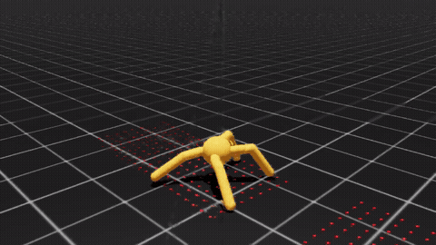
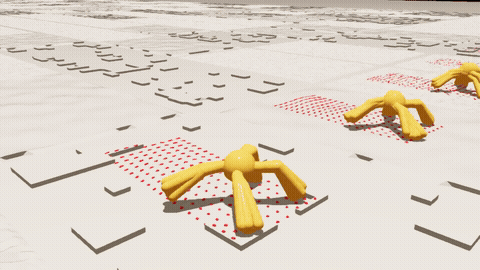

# 처음 보는 지형에서 가장 멀리 가는 Ant (4조, 과제 1)

평지에서만 배운 `Isaac-Ant-v0` 를 학습 때 보지 못한 지형·마찰에서 16초 동안 최대한 멀리 가게 만들었다.
보상 7개·종료 규칙·16초는 원본 그대로 두고, 걷는 대신 **다리를 바퀴살처럼 써서 앞으로 굴러가는 개미(구르기 v15)** 를 학습시켰다.

| 평지 | T2 (처음 보는 지형) |
| --- | --- |
| [](docs/assignment1/videos/v15_평지_16초.mp4) | [](docs/assignment1/videos/v15_T2_처음보는지형_16초.mp4) |

GIF 는 앞 6초. 누르면 16초 영상. 시험장 35종 전체: [`v15_시험장35종_격자.mp4`](docs/assignment1/videos/v15_시험장35종_격자.mp4), 팀원 평가맵: [`v15_팀원평가맵_긴맵_16초.mp4`](docs/assignment1/videos/v15_팀원평가맵_긴맵_16초.mp4)

## 결과 (`play_one_episode.py`, seed 24, 100마리, 원본 보상)

| 모델 | 처음 보는 지형 35종 평균 | T2 | 평지 | 팀원 평가맵 (짧은 / 긴) |
| --- | ---: | ---: | ---: | ---: |
| 원본 Ant | 24.0 | 20.7 ± 10.5 | 141.3 ± 35.9 | 9.8 / 9.7 |
| 걷기 + 높이 센서 + 지형 생성기 | 77.0 | 97.2 ± 17.8 | 127.8 ± 29.7 | - |
| 걷기 + 에너지 벌점 완화 | 92.1 | 125.7 ± 24.1 | 166.1 ± 31.6 | 32.6 / 36.7 |
| **구르기 v15 (제출 모델)** | **164.5** | **182.8 ± 5.8** | **182.5 ± 20.0** | **71.2 / 79.1** |

35종 개별 점수, 마찰별 점수, 학습 계보: [docs/assignment1/RESULTS.md](docs/assignment1/RESULTS.md)

## 평가 명령

```bash
conda activate lerobot-arena && cd ~/IsaacLab_RS
./isaaclab.sh -p scripts/reinforcement_learning/rsl_rl/play_one_episode.py \
  --task Isaac-Ant-Final-J200C-v0 --seed 24 --num_envs 100 --headless \
  --checkpoint logs/rsl_rl/ant/2026-10-02_12-19-07_fun17_roll15/model_13195.pt
```

- 채점 태스크의 보상은 원본 7개 그대로다. `play_one_episode.py` 는 수업 자료 원본 그대로.
- 처음 보는 지형은 원본과 같은 방식으로 `scene.terrain` 만 바꾸면 적용된다 (이 태스크는 지형을 건드리지 않는다). 지형 프림은 `/World/ground`.
- 전체 명령(참고 자료 7쪽 형식): [EVAL_COMMAND.txt](EVAL_COMMAND.txt)

## 원본과 다른 점

| 바꾼 것 | 내용 |
| --- | --- |
| 관측 60 → 240 | 몸통 앞 3 m 를 보는 높이 센서 180개 (RayCaster) |
| 로봇 접촉 여유 0.0032 → 0.04 m | 메시 땅에서 발이 튕기는 문제 수정 (학습 없이 T2 39.7 → 86.3) |
| 관절 가동 범위 ±100° | startup 이벤트로 설정. USD 수정 없음. 원본은 엉덩이 ±40°, 발목 30~100° |
| 자기 충돌 켬 | 다리가 몸통·다른 다리를 뚫지 않게 |
| 학습 때만 | 지형 생성기(도형 11종 무작위 조합) + 마찰 무작위 + 구르기 학습 보상 16개 |

USD, 링크 길이·질량·관절 개수, 토크, 채점 보상, 종료 규칙, 16초, PPO 설정은 원본 그대로. 전체 목록: [CHANGES.md](docs/assignment1/CHANGES.md), 보상: [REWARDS.md](docs/assignment1/REWARDS.md)

## 왜 구르기인가

1. 원본 Ant 는 T2 에서 20.7 점. 원인 두 가지: 메시 땅에서 발 접촉이 튕긴다(접촉 여유), 지형을 못 본다(관측).
2. 접촉 여유 수정 + 높이 센서 + 지형 생성기로 걷기 77.0, 보상 수정으로 92.1.
3. 원본 Ant 도 시간의 70 % 는 네 발이 공중이다. 관절 범위를 풀고 "땅에 닿았을 때만 구르기 점수" 를 주니 구르기 164.5.
4. 약점: 마찰 0.3 아래에서는 걷기가 더 낫고, 빙판(0.05)에서는 모두 0 근처.

## 폴더

| 위치 | 내용 |
| --- | --- |
| `source/isaaclab_tasks/isaaclab_tasks/manager_based/classic/ant_robust/` | 학습·평가 설정(`full_env_cfg.py`), 보상·센서 함수(`mdp.py`), 지형 생성기(`train_env_cfg.py`), 시험장 35종(`eval_env_cfg.py`) |
| `source/.../classic/ant_heldout/`, `ant_maps/` | 팀원 평가맵 |
| `logs/rsl_rl/ant/` | 학습 로그 (v11 → v13 → 긴 학습 → v15). 제출 체크포인트 `…_fun17_roll15/model_13195.pt` |
| `docs/assignment1/` | 결과표, 변경점, 보상, 설치 방법, 영상, 그림, 체크포인트 사본 |
| `scripts/assignment1/` | 35종 채점 스크립트, 학습 4단계 스크립트 |
